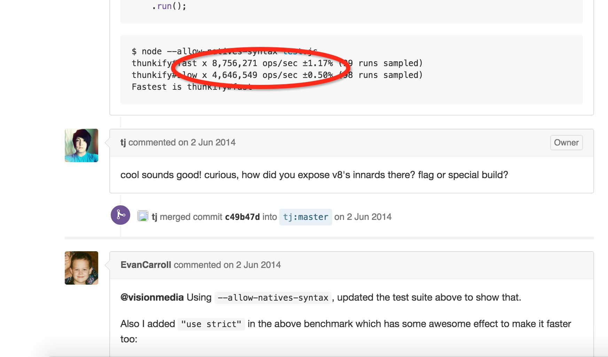
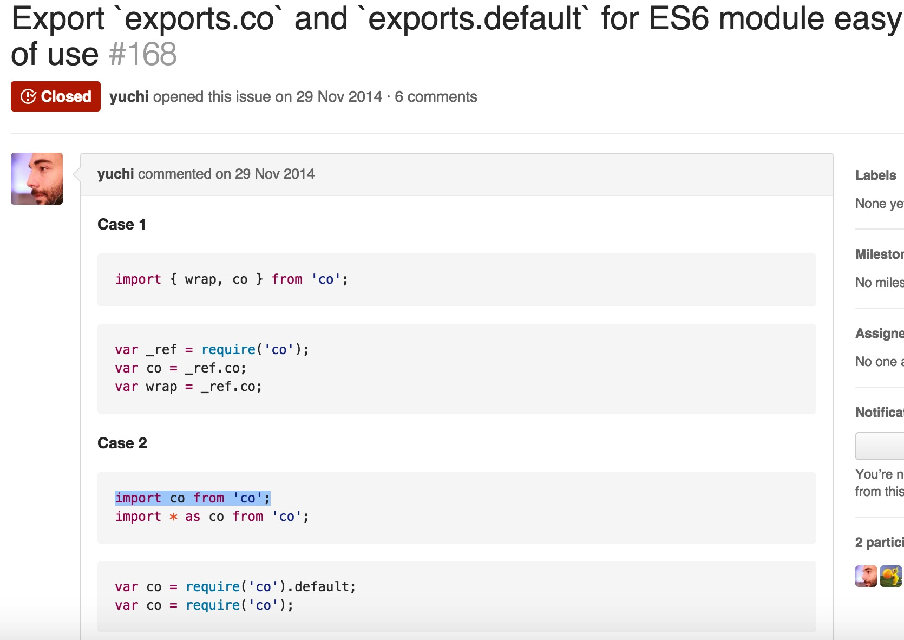
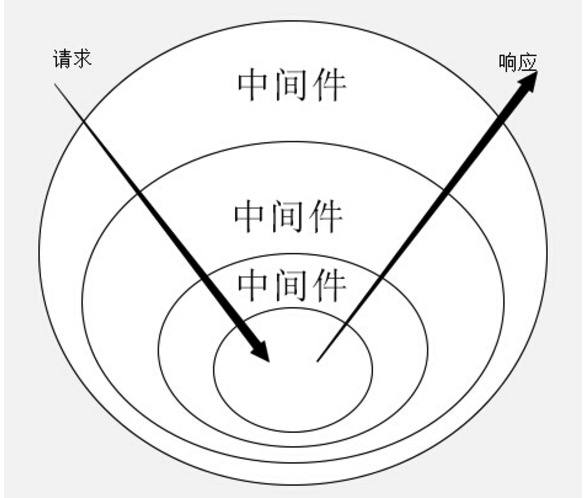

# Co源码以及与Koa的深入理解
tj大神的co，将本来应该是一个数据类型的generator变成了一种处理异步的解决方案

其实主要就是一个遍历函数，将promise或者generator的异步函数一直执行到得到最后的结果再返回，这样就可以把本来放到异步中的方法按照同步的顺序来写。

## yield
函数内部的yield后面传入的可以是以下

- Promise(就是promise嘛)
- thunks(就是一个偏函数，执行之后只有一个简单的拥有一个callback的参数的函数)
- array(通过array可以并行执行里面的function，`并行`是主要的价值)
- objects(和array相同，也是并行执行里面的yieldable，`并行`是主要的价值)
- generators
- generators functions(下面的这两个东西可以支持，但是并不被推荐，因为我们应该转向更加标准的promise)

## API
### co(fn*).then
将一个generator解决为一个promise

### var fn = co.wrap(fn*)
讲一个generator转化为一个返回promise的常规函数

## 本质的探索
他的最初实现是基于Thunk函数的。接收了一个生成器函数作为参数，并生成了一个实际操作函数，函数通过接收回调的方式来传入最后的返回值。

## 所以先了解下thunk函数
这东西的发展是由函数的求值策略的分歧决定的，两种求值策略

```javascript
  var b = 1;
 function a(x,y){
   return y;
 }
 a(b+1);
```

上面的代码一`b+1`在什么时候执行比较好，

一种是传值调用，在进入函数体之前就直接执行完，把值传进去。c语言是这么做的

一种是传名调用，将表达式传入函数体，只在用到他的时候求值。Hskell语言是这么做的

前一种会简单一些，但是会有性能损失，所以倾向于传名调用。

传名函数的编译器实现，其实就是放入一个临时函数，再将临时函数传入函数体，这个临时函数就叫做thunk函数。

js语言是传值调用，他的thunk含义有些不同，js中，thunk函数替换的不是表达式，而是多参数函数，将它替换成单参数的版本，且只接受回调函数作为参数。

```javascript
  //正常的readFile函数
  fs.readFile(fileName, callback);
  var readFileThunk = Thunk(fileName);
  readFileThunk(callback);
  //thunk版本的函数
  function Thunk(fileName){
    return function(callback){
      fs.readFile(fileName,callback);
    }
  }
```

所以其实任何有回调的函数都是可以搞成thunk形式的，下面是一个简单的生成器

```javascript
  var Thunk = function(fn){
    return function () {
      //先传入其他的参数初始化
      var args = Array.prototype.slice.call(arguments);
      //传入callback返回的函数
      return function(callback){
        args.push(callback);
        //实际调用的时候
        return fn.apply(this,args);
      }
    }
  }
  var readFileThunk = Thunk(fs.readFile);
  readFileThunk(fileA)(callback);
```

tj的thunkify源码
```javascript
/**
 * Module dependencies.
 */
var assert = require('assert');
/**
 * Expose `thunkify()`.
 */
module.exports = thunkify;
/**
 * Wrap a regular callback `fn` as a thunk.
 *
 * @param {Function} fn
 * @return {Function}
 * @api public
 */
function thunkify(fn){
  assert('function' == typeof fn, 'function required');
  return function(){
    //这里就是将所有的参数放进了一个新的数组，这里之所以不用[].slice。是因为有人在bluebird docs发现，如果直接这样泄露arguments，v8的一些优化的编译会被搁置，就会有性能上的损失。
    var args = new Array(arguments.length);
    var ctx = this;
    for(var i = 0; i < args.length; ++i) {
      args[i] = arguments[i];
    }
    return function(done){
      //这里用called是为了标记只执行了一次，类似于promise的resolve和reject只能执行一次一样。
      var called;
      args.push(function(){
        if (called) return;
        called = true;
        //因为arguments是一个list，必须得用apply才能在done传入。
        done.apply(null, arguments);
      });
      //这里用个try catch，可以在执行失败时走一遍callback，传入err信息
      try {
        fn.apply(ctx, args);
      } catch (err) {
        done(err);
      }
    }
  }
};
```




## generator函数的回调流程管理
包装成这样到底有个啥用场？用在了generator的流程管理

```javascript
var fs = require('fs');
var thunkify = require('thunkify');
var readFile = thunkify(fs.readFile);
var gen = function* (){
  var r1 = yield readFile('/etc/fstab');
  console.log(r1.toString());
  var r2 = yield readFile('/etc/shells');
  console.log(r2.toString());
};
var g = gen();
var r1 = g.next();
r1.value(function(err, data){
  if (err) throw err;
  var r2 = g.next(data);
  r2.value(function(err, data){
    if (err) throw err;
    g.next(data);
  });
});
```

就如同上面的，generator的执行过程实际上是将同一个回调函数，反复传入next的value结果中。这样我们就可以递归的来自动完成这个过程了。于是据诞生了基于thunk函数的执行器，也就是co了。

## 最简单的co
```javascript
function run(fn) {
  var gen = fn();
  function next(err, data) {
    var result = gen.next(data);
    if (result.done) return;
    result.value(next);
  }
  next();
}
run(gen);
```

执行器帮我们不停地调用传入生成器的next函数，如果done为true的时候，代表迭代完成，会将值传给回调函数。

当然前提是每一个一步函数都得是thunk函数的形式。

thunk并不是generator函数的自动执行的唯一方案。我们需要的其实只是一个机制，循环调用，并且交出和返回程序的执行权，thunk可以做到，promise也可以做到。

首先将readfile包装成promise形式
```javascript
var fs =require('fs');
var readFile  = function(fileName){
  return new Promise(function(resolve,reject){
    fs.readFile(fileName,function(error,data){
      if(error){reject(error)}
      resolve(data);
    })
  });
}
var gen = function* (){
  var f1 = yield readFile('f1.js');
  var f2 = yield readFile('f2.js');
  console.log(f1);
  console.log(f2);
}
```

然后手动执行下generator函数

```javascript
var g = gen();
g.next().value.then(function(data){
  g.next(data).value.then(function(data){
    g.next(data);
  });
})
```

写一个自动执行器

```javascript
function run(gen){
  var g = gen();
  function next(data){
    var result = g.next(data);
    if(result.done) return result.value;
    result.value.then(function(data){
      next(data);
    });
  }
  next();
}
```

## co的源码

下面的是co源码的逐行阅读，先把参照的一些图片列举出来

```javascript
  //array原生的slice
  var slice = Array.prototype.slice;
  //这里写的这么古怪就只是想在es6的模块引入时更加舒服一些，参见下面的图片3
  module.exports = co['default'] = co.co = co;
  //将传入的generator函数包装成一个返回promise的方法
  //这是一个独立的方法，就是将传入的函数包装成了co执行前的形式
  co.wrap = function (fn) {
    //存了一个指针指向原generator函数
    createPromise.__generatorFunction__ = fn;
    return createPromise;
    function createPromise() {
      //返回的方法调用就会直接执行co。
      return co.call(this, fn.apply(this, arguments));
    }
  };
  //执行generator或者generator函数然后返回一个promise
  function co(gen) {
    var ctx = this;
    var args = slice.call(arguments, 1)
    // 将所有的东西放到一个promise里面，来防止引起内存泄露错误的promise chaining。
    //tudo：看一下这个issue see https://github.com/tj/co/issues/180
    //参见下面的内存泄露的研究
    //https://github.com/promises-aplus/promises-spec/issues/179 看的我好累，完全没有看懂啊！！！
    //总之不管怎样，他是把传进来的东西包装成了一个promise
    return new Promise(function(resolve, reject) {
      //这里是判断下gen是不是函数，generators function执行之后是一个object
      if (typeof gen === 'function') gen = gen.apply(ctx, args);
      //传入的不是generators函数，没有next，就直接resolve返回结果;这里是错误兼容而已，因为co就是基于generator的，传入其他的没有意义
      if (!gen || typeof gen.next !== 'function') return resolve(gen);
      //主要就是走下面的onFulfilled方法，这个方法返回的是一个promise(resolve或者reject)
      onFulfilled();
      function onFulfilled(res) {
        var ret;
        try {
          //调用第一次next方法
          ret = gen.next(res);
        } catch (e) {
          //出错了直接reject出去
          return reject(e);
        }
        //将第一次的结果({done:true,value:{}})传入内部方法next
        next(ret);
      }
      //promise失败的时候调用
      //这里在promise错误的时候，就会尝试向外throw err。Genertor的属性，可以内部抛出，外部不活。如果我们对这个yield进行了try catch，就会被捕获，不处理的话，就会reject出去，在co的catch语句中co(*fn).catch处理。
      function onRejected(err) {
        var ret;
        try {
          ret = gen.throw(err);
        } catch (e) {
          return reject(e);
        }
        next(ret);
      }
      //循环得到next的结果，return的还是一个promise
      function next(ret) {
        //如果done为true的话，代表执行结束，返回一个resolve的promise
        if (ret.done) return resolve(ret.value);
        //既然还没执行完，就将ret.value转换成一个promise
        var value = toPromise.call(ctx, ret.value);
        //如果成功转化为了promise，就在这个promise执行完了再调用onFulfilled方法
        if (value && isPromise(value)) return value.then(onFulfilled, onRejected);
        return onRejected(new TypeError('You may only yield a function, promise, generator, array, or object, '
          + 'but the following object was passed: "' + String(ret.value) + '"'));
      }
    });
  }
  //将yield后面的东西转化成一个promise
  function toPromise(obj) {
    //如果不存在的话，直接返回，走最后的报错流程
    if (!obj) return obj;
    //判断传入的是不是promise，是的话直接返回
    if (isPromise(obj)) return obj;
    //判断传入的是不是generator，或者generator function，是的话，继续调用co函数进行循环~
    if (isGeneratorFunction(obj) || isGenerator(obj)) return co.call(this, obj);
    //如果就是个普通的thunk函数，也把他转化为promise
    if ('function' == typeof obj) return thunkToPromise.call(this, obj);
    //如果是array或者object的话，也走相应地变换方法
    if (Array.isArray(obj)) return arrayToPromise.call(this, obj);
    if (isObject(obj)) return objectToPromise.call(this, obj);
    //如果都不是，直接返回，走最后的报错流程
    return obj;
  }
  //这里将thunk转化成了promise，thunk就是调用的时候传入一个error和res的function，就在最外面包了个promise就行了
  function thunkToPromise(fn) {
    var ctx = this;
    return new Promise(function (resolve, reject) {
      fn.call(ctx, function (err, res) {
        if (err) return reject(err);
        if (arguments.length > 2) res = slice.call(arguments, 1);
        resolve(res);
      });
    });
  }
  //这里的array转化为promise其实就是通过Promise.all来包裹，这个方法只接受promise的数组，并且装化为一个新的promise
  //参见下面的promise平行执行的研究
  function arrayToPromise(obj) {
    return Promise.all(obj.map(toPromise, this));
  }
  //将一个object转化为promise，其实就是内部调用了promise.all方法而已
  function objectToPromise(obj){
    var results = new obj.constructor();
    var keys = Object.keys(obj);
    var promises = [];
    for (var i = 0; i < keys.length; i++) {
      var key = keys[i];
      var promise = toPromise.call(this, obj[key]);
      if (promise && isPromise(promise)) defer(promise, key);
      else results[key] = obj[key];
    }
    return Promise.all(promises).then(function () {
      return results;
    });
    function defer(promise, key) {
      // predefine the key in the result
      results[key] = undefined;
      promises.push(promise.then(function (res) {
        results[key] = res;
      }));
    }
  }
  //检查是否是promise，果然就是简单的判断他有没有then方法
  function isPromise(obj) {
    return 'function' == typeof obj.then;
  }
  //这里判断是不是generator就是判断他的next和throw方法是不是function
  function isGenerator(obj) {
    return 'function' == typeof obj.next && 'function' == typeof obj.throw;
  }
  //判断是否是generatorFunction就是判断了他的constructor的name
  function isGeneratorFunction(obj) {
    var constructor = obj.constructor;
    //这里是为了解决没有constructor的对象，比如Object.create(null)
    if (!constructor) return false;
    //这里两种情况会返回true，一种是名字正确地，一种是他的prototype是generator
    if ('GeneratorFunction' === constructor.name || 'GeneratorFunction' === constructor.displayName) return true;
    return isGenerator(constructor.prototype);
  }
   //就是通过constructor来判断是不是一个简单的对象
  function isObject(val) {
    return Object == val.constructor;
  }
```

### 图片3


### promise chaining导致的内存泄露
这里只是源码的一个小注释，去看了不少东西

阅读了https://github.com/tj/co/issues/180

有人发现在一个无限循环的for循环里面使用co调用一个异步操作，会发生内存泄露

有人推断是所有的promise都被连接了起来，阻止了gc的回收

有人测试了基于thunk的v3，发现ok，v4发现内存泄露，并且使用工具发现确实是promise的问题

死马说这事规范里的问题，bluebird和then/promise已经做出了修复，

最后hax说是es6 spec “bug”

接下来看一个[解决方案](http://stackoverflow.com/questions/15027192/how-do-i-stop-memory-leaks-with-recursive-javascript-promises)

就是用一个promise从外面包裹住全部，为什么这样有用？？！！

接下来阅读https://github.com/promises-aplus/promises-spec/issues/179

### promise的平行执行
promise被创建的时候就开始了他们的任务，是无法被执行的。他们只代表了结果的状态，将他们传给promise.all的时候甚至都是并行执行的。他不关心执行顺序，也不关心是否平行运行。
tudo:看一下nodejs的多线程？？


### Co的错误处理
这里主要是涉及到generator.throw方法，可以在generator外部抛出异常，而在generator内部来catch住异常。

co里面使用了这个属性，就可以针对某几个yield进行try catch，如果不进行处理，统一的会在后面的catch语句中`co(*fn).catch`找到。

### Koa执行的理解


请求进来的时候会一次经过各个中间件进行执行，中间件之间的跳转是yield next，执行完了之后就会逆序执行。

```javascript
app.use(function *(next){
  var start = new Date;
  //执行到这句话的时候跳到下一个中间件
  yield next;
  //下面的中间件执行完了之后再执行下面的部分
  var ms = new Date - start;
  console.log('%s %s - %s', this.method, this.url, ms);
});
```

#### 写两个yield next会有什么问题？
这里遇到yield next其实还是会继续向下执行下一个generator的，但是因为下一个中间件done的状态已经是true了，再次调用一下此前已经执行完的generator，调用返回的结果肯定还是done为true，因为此前已经执行完了。所以后面继续yield next是没有意义的~~

Koa的中间件是运行在co函数之下的。

#### Koa的中间件的实现
这里看到了一个Koa中间件的实现

```javascript
var gens = [];
function use(generetor){
    gens.push(generetor);
}
// 实现co函数
function co(flow, isGenerator){
    var gen;
    if (isGenerator) {
        gen = flow;
    } else {
        gen = flow();
    }
    return new Promise(function(resolve){
        var next = function(data){
            var result = gen.next(data);
            var value = result.value;
            // 如果调用完毕，调用resolve
            if(result.done){
                resolve(value);
                return;
            }
            // 如果为yield后面接的为generator，传入co进行递归，并且将promise返回
            if (typeof value.next === "function" && typeof value.throw === "function") {
                value = co(value, true);
            }
            if(value.then){
                // 当promise执行完毕，调用next处理下一个yield
                value.then(function(data){
                    next(data);
                })
            }
        };
        next();
    });
}
function trigger(){
    var prev = null;
    var m = gens.length;
    co(function*(){
        while(m--){
            // 形成链式generator
            prev = gens[m].call(null, prev);
        }
        // 执行最外层generator方法
        yield prev;
    })
}
use(function*(next){
    var d = yield new Promise(function(resolve){
        setTimeout(function(){
            resolve("step1")
        }, 1000)
    });
    console.log(d);
    yield next;
    console.log("step2");
});
use(function*(next){
    console.log("step3");
    yield next;
    var d = yield new Promise(function(resolve){
        setTimeout(function(){
            resolve("step4")
        }, 1000)
    });
    console.log(d);
});
use(function*(){
    var d = yield new Promise(function(resolve){
        setTimeout(function(){
            resolve("step5")
        }, 1000)
    });
    console.log(d);
    console.log("step6");
});
trigger();
```

tudo:啥叫链式的generator??

#### Koa的运行顺序图


这张图非常详细了，原来本身的respond，以及自己定义的一些中间件统一的会被整成一个generator，然后交给co来执行。

tudo:看到的一个博主说是这里模拟的async和await，这里可以去了解一下??

todu：那个内存泄露的问题看不懂啊，操！！先不管了，要死了


本文引用：

[http://segmentfault.com/a/1190000002783230](http://segmentfault.com/a/1190000002783230)

[http://www.ruanyifeng.com/blog/2015/05/thunk.html](http://www.ruanyifeng.com/blog/2015/05/thunk.html)

[http://www.cnblogs.com/axes/p/4683176.html](http://www.cnblogs.com/axes/p/4683176.html)

[http://purplebamboo.github.io/2015/01/16/koa-source-analytics-4/](http://purplebamboo.github.io/2015/01/16/koa-source-analytics-4/)
