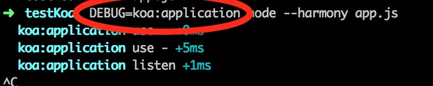

继着上文的[Co 源码以及与 Koa 的深入理解](https://github.com/panyifei/learning/blob/master/Nodejs/Co源码以及与Koa的深入理解.md)，开始学习下 Koa 是怎么写的。我看的版本是 1.1.2 的。

从 package.json 里面看，Koa 的入口是 application.js，于是先看这个 js。

### application 引用的模块

先从最开始引入的一些模块开始理解。

- debug：最开始引了一个外部的 debug 模块。这是个好东西，只要在运行的时候使用`DEBUG=..`就可以了进行代码的调试了，如下图，如果有多个的话可以用逗号分隔开。会有比较好看的风格，主要是用来替换 console.log 的，看上去更专业点。



- events：然后引用了 nodejs 的内置模块 events，将 application 的 prototype 设置了下
- composition：外部模块，试验性质。是可以将传入的函数包装成一个 promise 的。
- 主要是支持包括 es7 的 async 语法的，如果设置了 this.experimental，就会使用这个来执行，否则的话使用 co.wrap 方法。
- koalization 是不是打开了 experimental？
- on-finished：外部模块，是在 response 结束或者失败的时候触发的，如果失败了的话会带个 error 进来。
- response，request，context：3 个内部代码块，都是重新对 req，res 和 context 进行了封装。
- koa-compose：外部模块，是个核心方法，将所有的中间件嵌套为循环的 genreator，然后就可以交给 co 去 wrap 一下变成 promise，然后就可以直接执行了。
- koa-is-json：一个小的外部模块，用来检测 body 是不是 json
- statuses：外部模块，简单的 http 状态码的相互对应而已
- cookies：外部模块，进行 cookie 的管理
- accepts：外部模块，用来对请求头的 accepts 进行管理，处理
- assert：外部模块，用来写单元测试的
- stream：内置模块，用来处理流式的数据的
- http：内置模块，用来 createServer 的
- only：外部模块，用来返回一个新对象，包含只在传入的白名单中的属性
- co：外部模块，前面已经研究过的模块，不再详细记录，参见[Co](https://github.com/panyifei/learning/blob/master/Nodejs/Co源码以及与Koa的深入理解.md)

至此，使用的模块已经清楚，开始看下整个结构。

### application 的结构设计

Application 是被抛出去的总入口，是个`构造函数`，他的作用是

- 区分传入的环境参数
- 初始化存使用的中间件 middleware，一个空数组。
- 使用自己的包装过的 3 个内部代码来初始化上下文，req 和 res。

```javascript
function Application() {
  //这一句的作用挺精髓的，因为application是一个构造函数，如果没有new调用的话，就return一个new的
  //这里返回的是new Application，而不是new Application()，是不是有些奇怪，其实这两种写法在没有参数时没有区别，在有参数时，必须加上括号~
  if (!(this instanceof Application)) return new Application();
  //这句就是处理环境参数，默认为开发，代码里可以根据env的值来决定访问哪里的数据库，或者错误log的记录地点等等
  this.env = process.env.NODE_ENV || "development";
  //被忽略的子域名位数，比如ppe.b.dianping.com,他的默认子域名就为['ppe','b']，如果设置为3，子域名就为['ppe']
  //设置了这个值决定了我们在this.subdomains数组里面可以访问的值
  this.subdomainOffset = 2;
  //存中间件，下面的app.use方法直接push就好了
  this.middleware = [];
  //这个东西也不知道是啥。。
  //tudo：X-Forwarded-Proto？？
  this.proxy = false;
  //这三个东西就是作者包装后的上下文，req，res
  this.context = Object.create(context);
  this.request = Object.create(request);
  this.response = Object.create(response);
}
```

app 是 Application 的原型对象。

强行用 emitter 的原型来替换了 application 的原型。

```javascript
//这样子就继承了事件流
//然后下面的代码this.on('error',fn)来监听
//this.emit就可以触发
//这里想到了点评张老师的cortex里面的模块class也支持implement events这个东西，然后就去看了下他是怎么在browser端支持emitter的，原来是引用了npm的一个模块events
Object.setPrototypeOf(Application.prototype, Emitter.prototype);
```

然后对 app 进行原型上的包装。

- app.listen：来 createServer 的，将`this.callback`添加到了 request 事件上~注意是可以调用多次
- app.toJSON：公有方法，将他作为 json 输出时，会将 subdomainOffset，proxy，env 这几个值，好像并没有什么用..
- app.use：很清楚，就是往 middleware 里面 push 而已，如果没有打开试验选项 experimental，就只能传入 generator
- app.callback：处理中间件并且进行返回的地方
- app.createContext：私有方法，创建初始化的上下文
- app.onerror：私有方法，默认的错误处理
- respond：用来帮助返回的方法

主要的执行就是 app.callback 了，这里对代码进行注释

```javascript
app.callback = function() {
  //如果打开了实验的接口，就可以使用es7的async,不然使用koa-compose来进行包装，然后再传给co
  var fn = this.experimental ? compose_es7(this.middleware) : co.wrap(compose(this.middleware));
  var self = this;
  //看是否注册了错误事件，没有的话使用自身的onerror
  if (!this.listeners("error").length) this.on("error", this.onerror);
  return function(req, res) {
    res.statusCode = 404;
    //在这里对上下文，以及req和res进行了包装
    var ctx = self.createContext(req, res);
    //注册一下这个是为了处理error
    //当error发生时，调用了context的onerror，里面emit了app的onerror，这样上面的this.onerror就可以被触发了。
    //为什么这东西能够监听到res的error？？
    //tudo：怎么做到的
    onFinished(res, ctx.onerror);
    //然后执行那个co包装过的promise，成功的话执行respond方法，失败了执行this.onerror方法
    fn.call(ctx)
      .then(function() {
        respond.call(ctx);
      })
      .catch(ctx.onerror);
  };
};
```

respond 方法也挺有意思，注释一下

```javascript
function respond() {
  if (false === this.respond) return;
  var res = this.res;
  //如果头部已经发送，或者不能写了，跳过
  if (res.headersSent || !this.writable) return;
  var body = this.body;
  var code = this.status;
  //如果是一些不需要返回体的code，比如204:没有内容，比如304:未修改)，直接返回
  if (statuses.empty[code]) {
    this.body = null;
    return res.end();
  }
  //如果是head请求，返回一个length
  //head请求允许请求某个资源的响应头，而不要真正的资源本身
  if ("HEAD" == this.method) {
    if (isJSON(body)) this.length = Buffer.byteLength(JSON.stringify(body));
    return res.end();
  }
  //如果就是没有内容，就设置一个默认的返回
  if (null == body) {
    this.type = "text";
    body = this.message || String(code);
    this.length = Buffer.byteLength(body);
    return res.end(body);
  }
  //对不同的响应体进行判断并且返回
  if (Buffer.isBuffer(body)) return res.end(body);
  if ("string" == typeof body) return res.end(body);
  if (body instanceof Stream) return body.pipe(res);
  body = JSON.stringify(body);
  this.length = Buffer.byteLength(body);
  res.end(body);
}
```

### 这里再顺便看一下 koa-compose 的代码

代码非常精简，功能是将一堆 generator 的数组包装成嵌套的 generator
tudo:继续看，没看完呢。。。

```javascript
module.exports = compose;
/**
 * Compose `middleware` returning
 * a fully valid middleware comprised
 * of all those which are passed.
 *
 * @param {Array} middleware
 * @return {Function}
 * @api public
 */

function compose(middleware) {
  return function*(next) {
    if (!next) next = noop();

    var i = middleware.length;

    while (i--) {
      next = middleware[i].call(this, next);
    }

    yield* next;
  };
}
//私有方法
function* noop() {}
```

//如果想跳过某个中间件？？
//return yield next
//tudo

本文借鉴了

- [loveky 的博客](https://github.com/loveky/Blog/issues/3)
