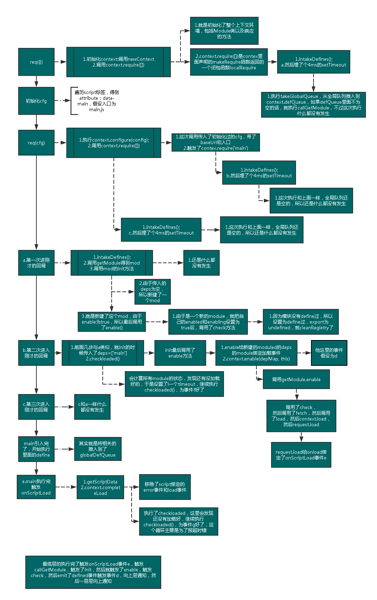

接着上文的[学习以及尝试实现](https://github.com/panyifei/learning/blob/master/框架以及规范/模块引入/Requirejs学习以及实现.md),准备好好看下源码的实现。

```
var requirejs, require, define;
(function (global, setTimeout){...}(this ,setTimeout));
```

整体结构就是放出了 3 个全局的变量，然后在一个匿名函数中对 3 个变量进行赋值。这里把 this 和 setTimeout 传进去应该是历史原因，怕这些东西被改写

然互看匿名函数的整体的结构：

- 最先申明了一些简写以及使用到的正则以及浏览器属性的判断。
- 然后申明了一些简单的辅助方法，包括一些循环，还有对象的检测。
- 然后是一个主要的方法 newContext。这个很长，慢慢看。
- 然后申明了 require 方法
- 然后调用了 req({});进行了最初的初始化
- 然后遍历拿到 script，来得到 data-main 的入口，与我的写法一样
- 然后申明了 define 方法
- 然后再执行了一次 req(cfg);用配置好的 cfg

## 执行的主要流程

主要是就是执行了一次 req({});然后初始化了 cfg，然后再执行了一次 req(cfg)。

这里函数执行的比较复杂，我花了一些时间画了一个图，画的精疲力尽：



图里面其实已经画的很详细了，我的图只是其中一种执行的顺序，简单总结就是

- 第一次 req()初始化环境
- 第二次 req()开始加载入口的模块
- define 函数实际上往全局的队列推入
- 模块加载好了会执行 onScriptLoad 方法，然后进行一层层的事件通知(注意事件是绑在依赖的模块上的，出发后，执行父模块的回调，然后再 emit 调用父模块的回调)
- 内部还是有轮询在检测是否加载完的，我个人认为这是在处理 error 事件，因为整体的执行并不依赖于这个轮询
- 他内部支持 commonjs 的方式其实就是用个正则表达式来进行检索，然后推入 deps 正常加载而已。就是个形式而已

## 小的 tip

nextTick 里面的 4ms 是因为[html5 的规范](https://html.spec.whatwg.org/multipage/webappapis.html#timers)要求的;最大值的话是 2 的 32 次方-1，如果超过了，会被立即执行。

## r.js

其实这个就是个与 requirejs 一起用的打包以及压缩的工具。他帮助合并了 requirejs 异步发出的请求，然后还用 uglify 压缩了一下。

参考：

    http://www.cnblogs.com/yexiaochai/p/3632580.html

    http://www.cnblogs.com/zhiyishou/p/4770013.html

    http://www.nihaoshijie.com.cn/index.php/archives/381
