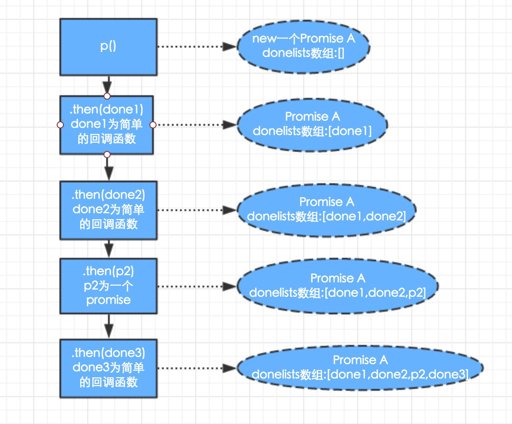

# Promise规范以及写一个Promise
看了些promise的介绍，但是还是感觉不够深入，这个在解决异步问题上是一个很好的解决方案，所以详细看一下。

## Promise/A+规范：
 - 重新阅读了下A+的[规范](https://promisesaplus.com/):
   - promise代表了一个异步操作的最终结果，主要是通过then方法来注册成功以及失败的情况，
   - Promise/A+历史上说是实现了Promise/A的行为并且考虑了一些不足之处，他并不关心如何创建，完成，拒绝Promise，只考虑提供一个可协作的then方法。

### 术语：
   - `promise`是一个拥有符合上面的特征的then方法的对象或者方法。
   - `thenable`是定义了then方法的对象或者方法
   - `value`是任何合法的js的值（包括undefined，thenable或者promise）
   - `exception`是一个被throw申明抛出的值
   - `reason`是一个指明了为什么promise被拒绝

### 2.1 状态要求：
   - promise必须是在pending，fulfilled或者rejected之间的一种状态。
   - promise一旦从pending变成了fulfilled或则rejected，就不能再改变了。
   - promise变成fulfilled之后，必须有一个value，并且不能被改变
   - promise变成rejected之后，必须有一个reason，并且不能被改变

### 2.2 then方法的要求：
   - promise必须有个then方法来接触当前的或者最后的value或者reason
   - then方法接受两个参数，done和onRejected，这两个都是可选的，如果传入的不是function的话，就会被忽略
   - 如果done是一个函数，他必须在promise完成后被执行(不能提前)，并且value是第一个参数，并且不能被执行超过一次
   - 如果onRejected是一个函数，他必须在promise拒绝后被执行(不能提前)，并且reason是第一个参数，并且不能被执行超过一次
   - done或者onRejected只能在执行上下文堆只包含了平台代码的时候执行(就是要求done和onrejected必须异步执行，必须在then方法被调用的那一轮事件循环之后的新执行栈执行，这里可以使用macro-task或者micro-task，这两个的区别参见[文章](https://github.com/panyifei/learning/blob/master/前端基础/Macro-task与Micro-task.md))
   - done或者onRejected必须作为function被执行(就是说没有一个特殊的this，在严格模式中，this就是undefined，在粗糙的模式，就是global)
   - then方法可能在同一个promise被调用多次，当promise被完成，所有的done必须被顺序执行，onRejected也一样
   - then方法必须也返回一个promise(这个promise可以是原来的promise，实现必须申明什么情况下两者可以相等)promise2 = promise1.then(done, onRejected);
    - 如果`done`和`onRejected`都返回一个value x，执行2.3Promise的解决步骤[[Resolve]](promise2, x)
    - 如果`done`和`onRejected`都抛出exception e，promise2必须被rejected同样的e
    - 如果`done`不是个function，且promise1 is fulfilled，promise2也会fulfilled，和promise1的值一样
    - 如果`onRejected`不是个function，且promise1 is rejected，promise2也会rejected，理由和promise1一样

  这里不论promise1被完成还是被拒绝，promise2 都会被 resolve的，只有出现了一些异常才会被rejected

### 2.3Promise的解决步骤==[[Resolve]](promise2, x)
 - 这个是将`promise`和一个值`x`作为输入的一个抽象操作。如果这个x是支持then的，他会尝试让promise接受x的状态；否则，他会用x的值来fullfill这个promise。运行这样一个东西，遵循以下的步骤
  - 如果promise和x指向同一个对象，则reject这个promise使用TypeError。
  - 如果x是一个promise，接受他的状态
   - 如果x在pending，promise必须等待x的状态改变
   - 如果x被fullfill，那么fullfill这个promise使用同一个value
   - 如果x被reject，那么reject这个promise使用同一个理由
  - 如果x是一个对象或者是个方法
   - 如果x.then返回了错误，则reject这个promise使用错误。
   - 如果then是一个方法，使用x为this，resolvePromise为一参，rejectPromise为二参，
    - 如果resolvePromise被一个值y调用，那么运行[[Resolve]](promise, y)
    - 如果rejectPromise被reason r，使用r来reject这个promise
    - 如果resolvePromise和rejectPromise都被调用了，那么第一个被调用的有优先权，其他的beihulue
    - 如果调用then方法得到了exception，如果上面的方法被调用了，则忽略，否则reject这个promise
   - 如果then方法不是function，那么fullfill这个promise使用x
  - 如果x不是一个对象或者方法，那么fullfill这个promise使用x

如果promise产生了环形的嵌套，比如[[Resolve]](promise, thenable)最终唤起了[[Resolve]](promise, thenable)，那么实现建议且并不强求来发现这种循环，并且reject这个promise使用一个TypeError。

## 写一个promise
想要写一个Promise，肯定得使用一个异步的函数，就拿setTimeout来做。

```javascript
var p = new Promise(function(resolve){
    setTimeout(resolve, 100);
});
p.then(function(){console.log('success')},function(){console.log('fail')});
```

### 初步构建
上面是个最简单的使用场景我们需要慢慢来构建

```javascript
function Promise(fn){
  //需要一个成功时的回调
  var doneCallback;
  //一个实例的方法，用来注册异步事件
  this.then = function(done){
    doneCallback = done;
  }
  function resolve(){
    doneCallback();
  }
  fn(resolve);
}
```

### 加入链式支持
下面加入链式，成功回调的方法就得变成数组才能存储

```javascript
function Promise(fn){
  //需要成功以及成功时的回调
  var doneList = [];
  //一个实例的方法，用来注册异步事件
  this.then = function(done ,fail){
    doneList.push(done);
    return this;
  }
  function resolve(){
    doneList.forEach(function(fulfill){
      fulfill();
    });
  }
  fn(resolve);
}
```

这里promise里面如果是同步的函数的话，doneList里面还是空的，所以可以加个setTimeout来将这个放到js的最后执行。这里主要是参照了promiseA+的规范，就像这样

```javascript
function resolve(){
  setTimeout(function(){
    doneList.forEach(function(fulfill){
      fulfill();
    });
  },0);
}
```

### 加入状态机制
这时如果promise已经执行完了，我们再给promise注册then方法就怎么都不会执行了，这个不符合预期，所以才会加入状态这种东西。更新过的代码如下

```javascript
function Promise(fn){
  //需要成功以及成功时的回调
  var state = 'pending';
  var doneList = [];
  //一个实例的方法，用来注册异步事件
  this.then = function(done){
    switch(state){
      case "pending":
        doneList.push(done);
        return this;
        break;
      case 'fulfilled':
        done();
        return this;
        break;
    }
  }
  function resolve(){
    state = "fulfilled";
    setTimeout(function(){
      doneList.forEach(function(fulfill){
        fulfill();
      });
    },0);
  }
  fn(resolve);
}
```

### 加上异步结果的传递
现在的写法根本没有考虑异步返回的结果的传递，我们来加上结果的传递

```javascript
function resolve(newValue){
  state = "fulfilled";
  var value = newValue;
  setTimeout(function(){
    doneList.forEach(function(fulfill){
      value = fulfill(value);
    });
  },0);
}
```

### 支持串行
这样子我们就可以将then每次的结果交给后面的then了。但是我们的promise现在还不支持promise的串行写法。比如我们想要

```javascript
var p = new Promise(function(resolve){
    setTimeout(function(){
      resolve(12);
    }, 100);
});
var p2 = new Promise(function(resolve){
    setTimeout(function(){
      resolve(42);
    }, 100);
});
p.then(
      function(name){
        console.log(name);return 33;
      }
  )
  .then(function(id){console.log(id)})
  .then(p2)
  .then(function(home){console.log(home)});
```

所以我们必须改下then方法。

当then方法传入一般的函数的时候，我们目前的做法是将它推进了一个数组，然后return this来进行链式的调用，并且期望在resolve方法调用时执行这个数组。

最开始我是研究的美团工程师的[一篇博客](http://tech.meituan.com/promise-insight.html),到这里的时候发现他的解决方案比较跳跃，于是我就按照普通的正常思路先尝试了下：

如果传入一个promise的话，我们先尝试继续推入数组中，在resolve的地方进行区分，发现是可行的，我先贴下示例代码，然后会有详细的注释。

```javascript
function Promise(fn){
  //需要成功以及成功时的回调
  var state = 'pending';
  var doneList = [];
  this.then = function(done){
    switch(state){
      case "pending":
        doneList.push(done);
        return this;
        break;
      case 'fulfilled':
        done();
        return this;
        break;
    }
  }
  function resolve(newValue){
    state = "fulfilled";
    setTimeout(function(){
      var value = newValue;
      //执行resolve时，我们会尝试将doneList数组中的值都执行一遍
      //当遇到正常的回调函数的时候，就执行回调函数
      //当遇到一个新的promise的时候，就将原doneList数组里的回调函数推入新的promise的doneList，以达到循环的目的
      for (var i = 0;i<doneList.length;i++){
        var temp = doneList[i](value)
        if(temp instanceof Promise){
            var newP =  temp;
            for(i++;i<doneList.length;i++){
                newP.then(doneList[i]);
            }
        }else{
            value = temp;
        }
      }
    },0);
  }
  fn(resolve);
}
var p = function (){
    return new Promise(function(resolve){
        setTimeout(function(){
          resolve('p 的结果');
        }, 100);
    });
}
var p2 = function (input){
    return new Promise(function(resolve){
        setTimeout(function(){
            console.log('p2拿到前面传入的值：' + input)
            resolve('p2的结果');
        }, 100);
    });
}
p()
.then(function(res){console.log('p的结果:' + res); return 'p then方法第一次返回'})
.then(function(res){console.log('p第一次then方法的返回：'+res); return 'p then方法第二次返回'})
.then(p2)
.then(function(res){console.log('p2的结果：' + res)});
```

### 加入reject
我按照正常思路这么写的时候发现出了点问题，因为按照最上面的规范。即使一个promise被rejected，他注册的then方法之后再注册的then方法会可能继续执行resolve的。即我们在then方法中为了链式返回的this的status是可能会被改变的，假设我们在实现中来改变状态而不暴露出来(这其实一点并不推荐)。

我直接贴实现的代码，还有注释作为讲解

```javascript
function Promise(fn){
  var state = 'pending';
  var doneList = [];
  var failList= [];
  this.then = function(done ,fail){
    switch(state){
      case "pending":
        doneList.push(done);
        //每次如果没有推入fail方法，我也会推入一个null来占位
        failList.push(fail || null);
        return this;
        break;
      case 'fulfilled':
        done();
        return this;
        break;
      case 'rejected':
        fail();
        return this;
        break;
    }
  }
  function resolve(newValue){
    state = "fulfilled";
    setTimeout(function(){
      var value = newValue;
      for (var i = 0;i<doneList.length;i++){
        var temp = doneList[i](value);
        if(temp instanceof Promise){
            var newP =  temp;
            for(i++;i<doneList.length;i++){
                newP.then(doneList[i],failList[i]);
            }
        }else{
            value = temp;
        }
      }
    },0);
  }
  function reject(newValue){
    state = "rejected";
    setTimeout(function(){
      var value = newValue;
      var tempRe = failList[0](value);
      //如果reject里面传入了一个promise，那么执行完此次的fail之后，将剩余的done和fail传入新的promise中
      if(tempRe instanceof Promise){
        var newP = tempRe;
        for(i=1;i<doneList.length;i++){
            newP.then(doneList[i],failList[i]);
        }
      }else{
        //如果不是promise，执行完当前的fail之后，继续执行doneList
        value =  tempRe;
        doneList.shift();
        failList.shift();
        resolve(value);
      }
    },0);
  }
  fn(resolve,reject);
}
var p = function (){
    return new Promise(function(resolve,reject){
        setTimeout(function(){
          reject('p 的结果');
        }, 100);
    });
}
var p2 = function (input){
    return new Promise(function(resolve){
        setTimeout(function(){
            console.log('p2拿到前面传入的值：' + input)
            resolve('p2的结果');
        }, 100);
    });
}
p()
.then(function(res){console.log('p的结果:' + res); return 'p then方法第一次返回'},function(value){console.log(value);return 'p then方法第一次错误的返回'})
.then(function(res){console.log('p第一次then方法的返回：'+res); return 'p then方法第二次返回'})
.then(p2)
.then(function(res){console.log('p2的结果：' + res)});
```
用图片展示一下思路的话可能会更清晰些：

then方法的初始化过程很简单：



执行时的过程是这样的：


正常思路的解决方案基本就是这样了

### 另外的套路
看的一篇美团工程师的博文，解决思路是每次then方法返回的都是一个新的promise，这样其实对于规范来说是最准确的，因为这样子我们就不需要改变promise的状态了。

```javascript
function Promise(fn){
    var state = 'pending';
    var doneLists = [];
    this.then = function(done){
        return new Promise(function(resolve){
            handle({
                done: done || null,
                resolve: resolve
            });
        });
    }
    function resolve(newValue) {
        if (newValue && (typeof newValue === 'object' || typeof newValue === 'function')) {
            var then = newValue.then;
            if (typeof then === 'function') {
                then.call(newValue, resolve);
                return;
            }
        }
        state = 'fulfilled';
        value = newValue;
        setTimeout(function () {
            doneLists.forEach(function (deferred) {
                handle(deferred);
            });
        }, 0);
    }
    function handle(deferred) {
        if (state === 'pending') {
            doneLists.push(deferred);
            return;
        }
        var ret = deferred.done(value);
        deferred.resolve(ret);
    }
    fn(resolve);
}
var p = function (){
    return new Promise(function(resolve){
        setTimeout(function(){
          resolve('p 的结果');
        }, 100);
    });
}
p()
.then(function(res){console.log('p的结果:' + res); return 'p then方法第一次返回'},function(value){console.log(value);return 'p then方法第一次错误的返回'})
.then(function(res){console.log('p第一次then方法的返回：'+res); return 'p then方法第二次返回'})
```

这个思路就是说：

 - 调用Promise a的then方法会创建一个Promise b,然后将参数done和b的resolve方法作为对象推入a的doneLists数组中；
 - 然后处理顺序就是遍历a的doneLists时，执行done，然后调用b的resolve；
 - 这样then如果传入的是一个执行之后是promise的方法，就在上一层resolve时再用.then方法包装一环；

 then方法的运行图像就像是这样的：

 

执行过程就像是下面这样：


### 其他的思路
tudo:待定

参考：

 - [PromiseA+的规范](https://promisesaplus.com/)
 - http://tech.meituan.com/promise-insight.html
