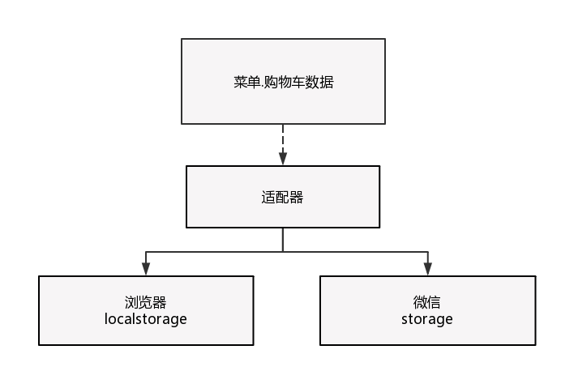

# 微信小程序逻辑层
## 总览
本文接上期的大众点评点餐小程序开发经验 - 视图层，本期想要和大家分享一下小程序开发中的逻辑层的经验。

与视图层微信自己定义了一套与HTML对应的WXML和WXSS不同，小程序的逻辑层还是使用javascript编写的。不过与我们普通的编写js还是有一些区别的。接下来我会根据实践进行说明。逻辑层代码结构为

 - menu
  - menu.js
 - app.js

## App和Page
小程序提供了App方法来注册整个小程序，在App方法里我们可以传入一个对象，指定小程序的生命周期函数以及自定义的函数或者数据。注意这个函数只能被调用一次。


如上图所示，App拥有着4个生命周期函数，我们可以在launch的时候进行一些全局信息的获取，比如用户信息，门店信息等等，然后存入到全局数据中。这里的数据可以被每个页面访问到。

小程序针对每个页面提供了Page的函数。整个逻辑层大部分的代码都会写在Page函数中，Page中承接着整个页面的数据，生命周期函数，以及在视图中绑定的事件的触发函数，例如各点击事件。整个Page函数允许的参数为下图所示：


如图，Page函数因为是页面级别的，所以拥有着更多的生命函数，会有下拉刷新事件，会有页面到达底部的事件。这里我们需要区别好各个生命周期函数。onLoad只会在初始化的时候调用一次，onShow是每次打开页面都会调用，onReady只有页面初次渲染完成才会被调用。onHide会在navigateTo(微信提供的跳转API)或者底部tab切换时调用，onUnload会在redirectTo(微信提供的redirect的API)或者navigateBack(微信提供的回退的API)的时候调用。Page更具体的渲染过程可以参考下面这张图：


简单描述下就是：视图层和逻辑层同时进行初始化，视图层init之后通知逻辑层发送数据。逻辑层执行onload和onShow，然后接收到视图层的通知之后发送数据给视图层，视图层进行初次渲染后通知逻辑层渲染完毕，逻辑层此时调用onReady方法。然后逻辑层可以通过再次发送数据重新渲染视图层。

Page的整个工作流程可以参照下面的图：


首先Page的data会被用于页面的初始化渲染。然后用户会在页面上，也就是展示层触发事件，比如我们点餐的话，点击了加菜按钮。页面监听到这个事件之后，会触发在Page函数中申明的自定义事件。然后根据具体情况可能会调用微信的Api发起请求，根据请求的结果，我们调用setData方法，来改变页面的数据，小程序就会监听到数据的改变而重新执行渲染的过程。这个写过React的朋友，应该会很熟悉，React也是在Component里面申明自定义方法，触发后通过setState来重新渲染页面。我们之前的H5就是使用React写的，所以逻辑层迁移到小程序的代价并不是很大~

### getApp和getCurrentPages
小程序内申明的变量和函数只在该文件内有效，不同的文件可以申明相同名字的变量和函数，并不会相互影响。上面提到App内可以设置全局数据。我们在每个Page里面都可以通过全局函数getApp()来拿到全局的引用实例。然后就可以访问页面的数据。比如我们在购物车下完单之后回到菜单页可能会需要进行菜单的刷新，我们在购物车页面就会调用getApp().data.menuRefresh = true，然后在菜单页的onShow方法进行判断，例如:

```javascript
let app = getApp();
Page(
    requestMenu () {   
        //刷新菜单
    };
    onShow () {
        if (.data.menuRefresh === true) {
            getApp().data.menuRefresh === false;
            this.requestMenu();
        }
    }
);
```

在每个Page内，我们还可以用getCurrentPages来获取当前页面栈的实例，数组形式，第一个元素为首页，最后一个元素为当前页面。


注意我们不能去尝试修改页面栈，我们只能根据页面栈，来分析是使用哪种微信的API来跳页面。这里的跳转Api还会在下面进行讲解。

## 模块化
小程序是支持模块化的，支持commonjs的模块化写法，也就是module.exports或者exports，这两个的区别这里就不细讲了，不了解的可以去看下nodejs的module那块的文档。小程序目前并不支持引入node_modules，也就是并不支持第三方的模块，当我们需要使用到外部的依赖的时候，建议直接将代码拷贝到小程序的目录中。

### 微信API
小程序作为微信的一个重要功能，微信的框架提供了非常丰富的微信原生API，可以方便的调起微信提供的能力，如扫码，定位，媒体播放，本地存储以及支付功能等等。

我们这次使用的较多的是通过微信发起网络请求以及微信的数据存储。

#### wx.request
微信提供了wx.request来发起请求，注意这个方法发起的是HTTPS请求。我们在使用的时候，使用了pinkie这个包将request包装成了Promise的形式方便我们使用。比较重要的一点是微信的运行环境并不是浏览器，并不提供cookie的功能，下单什么的用户鉴别的时候我们是会带上用户的token的，用户的token是在用户登录之后放到了App的全局数据中。

#### 数据存储
我们大众点评点餐页面上有大量的菜单数据，这部分数据之前在H5上实现的时候用的是浏览器的localstorage。这次切换到微信的storage，代价很小，用了一下适配器模式，将微信的数据接口适配成我们需要的接口就好了。这样也是为了以后的迭代慢慢让H5与小程序使用同一套代码。



#### 导航
小程序为了减少用户使用的时候的困扰，规定了页面路径最多只能有5层，所以我们使用的时候得尽量避免多层级的交互方式。


为了方便调用，我们这次管理页面跳转自己封装了一下函数:

```javascript
module.exports = function go2Page(opts) {
    if (!opts) return;
    if (!opts.url) return;
    let url = opts.url;
    const history = getCurrentPages();
    let path = url.split('?')
    let params;
    if (path.length === 2) {
        params = path[1];
    }
    let page = path[0].split('/').pop();
    let index = -1;
    for (var i = 0; i < history.length; i++) {
        let hPath = history[i].__route__;
        let hPage = hPath.split('/').pop();
        if (page == hPage) {
            index = i;
            break;
        }
    }
    if (index === -1) {
        wx.navigateTo({
            url: url
        });
    } else {
        if (params) {
            params = query(params);
        }
        app.store(page, params);
        wx.navigateBack({
            delta: history.length - (index + 1)
        });
    }
}
```

还有就是由于框架并非运行在浏览器中，所以javascript在web端的一些能力都无法使用，除了上面提到的cookie，还有document，window等等。开发者所有代码最终会被打包成一份javascript，在小程序启动的时候运行，直到小程序销毁。这一点类似于浏览器的ServiceWorker，所以逻辑层也称之为App Service。

本文时间为2017-03-02，所提小程序暂不支持属性或碰到的bug以此时间为准，后续更新或修复请查看官方文档。

参考资料：
微信小程序开发者文档
