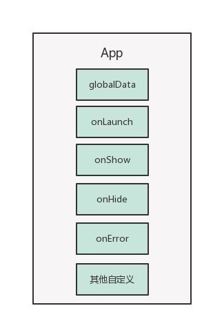
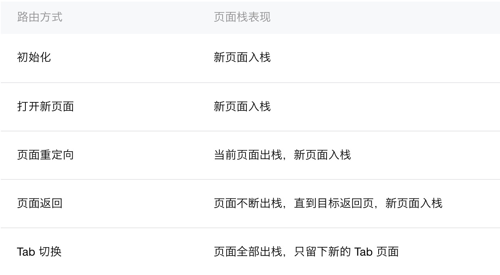

# 微信小程序逻辑层
## 总览
此文接上文的视图层，与视图层微信自己定义了一套与HTML对应的规则不同，小程序的逻辑层还是使用javascript编写的。不过与我们普通的编写js还是有一些区别的。接下来我会根据实践进行说明。

## App和Page
小程序提供了App方法来注册整个小程序，在App方法里我们可以传入一个对象，指定小程序的声明周期函数以及自定义的函数或者数据。注意这个函数只能被调用一次。



如上图所示，App拥有着4个生命周期函数，我们可以在launch的时候进行一些全局信息的获取，然后存入到全局数据中。

小程序正对每个页面提供了Page的函数。我们大部分的逻辑都是会写在Page函数中，Page中承接着整个页面的数据，生命周期函数，以及在视图中绑定的事件的触发函数。


如图所示，Page拥有着更多的生命函数，因为是页面级别的，所以会有下拉刷新事件，会有到达底部的事件。这里需要区别好各个生命周期函数。onLoad只会调用一次，onShow是每次打开页面都会调用，onReady只有页面初次渲染完成才会被调用。onHide会在navigateTo(微信提供的跳转API)或者底部tab切换时调用，onUnload会在redirectTo(微信提供的redirect的API)或者navigateBack(微信提供的回退的API)的时候调用。Page更具体的渲染过程可以参考下面这张图：


视图层和逻辑层同时进行初始化，视图层init之后通知逻辑层发送数据。逻辑层执行onload和onShow，然后接收到视图层的通知之后发送数据给视图层，视图层进行初次渲染后

Page的整个协作流程可以参照下面的图：


首先Page的data会被用于页面的初始化渲染。然后用户会在页面上，也就是展示层触发事件，比如我们点餐的话，点击了加菜按钮。页面监听到这个事件之后，回去触发在Page函数中申明的自定义事件。然后会可能会调用微信的Api发起请求，根据请求的结果，我们调用setData方法，来改变页面的数据，小程序就会根据数据的改变而重新执行渲染的过程。这个写过React的朋友，应该会很熟悉，跟React通过setState重新渲染页面非常相似。

### getApp和getCurrentPages
小程序内申明的变量和函数只在该文件内有效，不同的文件可以申明相同名字的变量和函数，并不会相互影响。上面提到App内可以设置全局数据。我们在每个Page里面都可以通过全局函数getApp()来拿到全局的引用实例。然后就可以访问页面的数据。比如我们菜单页可能会需要进行刷新，我们在购物车页面就会调用getApp().data.menuRefresh = true，然后在菜单页的onShow方法进行判断，例如:

```javascript
let app = getApp();
Page(
    requestMenu () {    
    };
    onShow () {
        if (.data.menuRefresh === true) {
            getApp().data.menuRefresh === false;
            this.requestMenu();
        }
    }
);
```

在每个Page内，我们还可以用getCurrentPages来获取当前页面栈的实例，数组形式，第一个元素为首页，最后一个元素为当前页面。



注意我们不能去尝试修改页面栈，我们只能根据页面栈，来分析是使用哪种微信的API来跳页面。这里的跳转Api还会在下面进行讲解。

## 模块化
小程序是支持模块化的，支持commonjs的模块化写法，也就是module.exports或者exports，这两个的区别这里就不细讲了，不了解的可以去看下nodejs的module那块的文档。小程序目前并不支持引入node_modules，当我们需要使用到外部的依赖的时候，建议将代码拷贝到小程序的目录中。

### 微信API
框架提供了丰富的微信原生API，可以方便的调起微信提供的能力，如获取用户的信息，本地存储以及支付功能等等。

我们这次使用的较多的是wx.request和微信的数据存储。

#### wx.request
注意这个方法发起的是HTTPS请求。我们在使用的时候，使用了pinkie这个包将request包装成了Promise的形式方便我们使用。

#### 数据存储
我们点餐页面上有大量的菜单数据，这部分数据之前在H5上实现的时候用的是浏览器的localstorage。这次切换到微信的storage，代价很小，用了一下适配器模式，将微信的数据接口适配成我们需要的接口就好了。

#### 导航
小程序为了减少用户使用的时候的困扰，规定了页面路径最多只能有5层，所以我们使用的时候得尽量避免多层级的交互方式。


