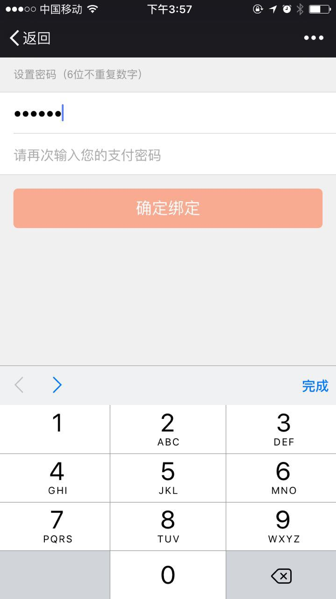
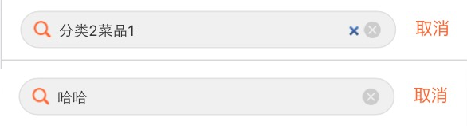

# 移动开发相关

### 页面从缓存中拿`onpageshow`
后退键在安卓和ios上的表现不同，安卓的后退键会默认地把页面刷新一次。然而ios则会从页面的cache中拿取页面，而不会再次执行js代码，导致了一些问题。解决办法是通过给window绑定`onpageshow`，然后判断`event.persisted`，如果是从缓存中拿取的，就location.reload一下，就会重新执行一下页面的js了。

```javascript
	window.onpageshow = function(event) {
        if (event.persisted) {
           location.reload();
        }
    };
```

### 锁住整个页面不让滑动
讲道理的话，给`body`一个`overflow:hidden`就行了

```css
.fix-scroll{
    position: absolute;
    width: 100%;
    height:100%;
    overflow:hidden;
}
```

但是移动浏览器安卓2.3对于锁住滑动支持的不好

所以完美的解决在于，`body`和`html`都加上上述的类就行了


### 移动端不用`placeholder`
placeholder本身浏览器的支持还是不错的，但是如果想控制placeholder的属性，`::-webkit-input-placeholder`支持的就不好了

于是使用替代的data-placeholder

然后在div中添加以下代码

```css
    &::after {
        content: attr(data-placeholder);
        display: block;
        position: absolute;
        top: 50%;
        right: 10px;
        .transform(translateY(-50%));
        white-space: nowrap;
        font-size: 15px;
        color: @color-text-grey;
        z-index: -1;
    }
    &.has-value::after {
        display: none;
    }
```

通过切换has-value就可以切换展示与否了

### 安卓2.3不支持react,使用`ES5-shim`
因为安卓2.3对于es5的属性不能完全的支持，而react里面用到了bind，freeze等等es5才支持的属性，所以直接使用，会挂。

直接在页面上引入了`es5-shim.js` 和 `es5-shim.min.js`这两个js就搞定了。[代码地址](https://github.com/es-shims/es5-shim/)

功能是让那些对es5支持的不好的浏览器可以使用es5的特性。

### 安卓2.3对于空格符的支持
必须得写成`&nbsp;`，如果不加分号安卓2.3会不识别，其他都识别的

### 安卓2.3在input获得焦点的时候会有黄色边框
加上这个属性就可以搞定了

```css
input:focus{
      -webkit-tap-highlight-color:rgba(0,0,0,0);
    }

```

### 安卓2.3拿到domain需要拼装一下
一般的只需要`location.origin`就可以拿到了，但是安卓2.3需要`location.protocol + '//' + location.host`这样才能够保证兼容性。

### genomotion小bug
测试轮询ajax刷新状态的，结果genomotion的模拟器居然同样的请求不重新请求，导致一直是失败的状态，坑爹的模拟器

### ios隐身模式下禁用localstorage
处理localstorage的地方用try catch包裹住，防止js报错从而卡住了页面

### display:flex的注意点
这个很神奇，让元素拥有自动扩展和收缩的能力，非常好用，注意里面的子元素都必须是block的，否则android下面会有问题

### align-items:center
这个属性是与display:flex配合使用的，是用来垂直方向上的居中对齐的，很好用，是用来在flex中替代vertical-align:middle的。

注意安卓机器只能识别为display:-webkit-box，这时得加上 -webkit-box-align:center;才行！！！！

而且iphone 7版本(5s)的得加上-webkit-align-items:center;

## ios input自带的border-radius和阴影背景
这样可以去掉

```css
border-radius: 0px;
-webkit-appearance:none;
```

## transform 使用百分比进行动画在安卓低版本版本下会有bug
参见例子[zepto_onepage_scroll](http://www.thepetedesign.com/demos/zepto_onepage_scroll_demo.html),这个网站在低版本4.1的三星下是有问题的，因为在translate3d时用了百分比，最后改了代码，使用了px作为单位就正常了

## fixed父元素的子元素想使用zepto来控制hide和show，结果4.1的三星就没有效果了
解决方法直接在父元素上调用hide或者show，或者给子元素也加上fixed属性就行了

## 输入密码的同时唤起数字键盘
```html
<input type="password" pattern="[0-9]*" >
```
这样在ios下可以完美的唤起数字键盘，并且输入会被掩码盖住，部分安卓机下有效



## 安卓机下去掉select元素的上下的那个小符号
使用`-webkit-appearance: none;`


### 字体被透明化


把背景的opacity去掉，然后background-color改为background:rgba(0, 0, 0, 0.7)，这个会比较好用，手机上的兼容性不错，上图的左边为优化过的，不被透明化了。

### input输入框右侧出现的小叉叉

```css
//IE下
input::-ms-clear { display: none; }
//chrome内核
input::-webkit-search-cancel-button{
    display:none;
}
```

### fixed属性在小键盘弹出的时候失效
我们有时把input的搜索框fixed在页面上，然后在手机的小键盘弹出时，fixed属性会失效，我们的解决办法可以把整个页面变成竖向的flex布局。

### 设置了overflow:scroll之后手机上滑动感觉不流畅
-webkit-overflow-scrolling: touch;

设置了这个属性之后，在手机上的滑动变的更丝滑了

### emoji表情插入后端数据库出错
因为数据库是UTF-8的，而手机的emoji表情是UTF-16位的。插入数据库就会出错，所以js做了层阻拦，就是用一层正则'/[\uD800-\uDBFF][\uDC00-\uDFFF]/g'检验了一下，但是阻止emoji有些不人性化啊。
